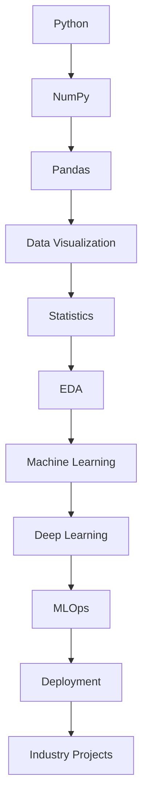

<div align="center">

# 🚀 DATA SCIENCE : MY JOURNEY BEGINS


### 👨‍💻 Kabir Roy

### 🎓 B.Tech CSE | VIT Bhopal

### 📊 Aspiring Data Scientist | ML Engineer


</div>

---

# 🌌 About This Repository

This repository serves as a public journal of my complete Data Science journey.

Rather than simply collecting code, this repository focuses on:

✔ Strong Mathematical Foundations

✔ Data Analysis & Visualization

✔ Machine Learning Algorithms

✔ Deep Learning Architectures

✔ Real World Projects

✔ Research-Oriented Learning

✔ Model Deployment & MLOps

Every notebook, experiment, project, dataset exploration, and learning note will be documented here.

---

# 📍 Current Mission

```yaml
Goal:
  Become Industry Ready Data Scientist

Focus:
  - Python
  - NumPy
  - Pandas
  - Statistics
  - Machine Learning
  - Deep Learning

Target:
  Build 25+ Projects
  Participate in Hackathons
  Publish Research
  Secure Data Science Internship
```

---

# 🧠 Learning Dashboard

| Domain           | Progress        |
| ---------------- | --------------- |
| Python           | ██████████ 100% |
| NumPy            | ██████████ 100% |
| Pandas           | ██████████ 100% |
| Statistics       | ░░░░░░░░░░ 0%   |
| Machine Learning | ░░░░░░░░░░ 0%   |
| Deep Learning    | ░░░░░░░░░░ 0%   |

---

# 🗺️ Data Science Roadmap



---

# 🛠 Tech Stack

<p align="center">


</p>

---

# 📚 Topics Covered

## Programming

* Python
* OOP
* Exception Handling
* File Handling

## Data Analysis

* NumPy
* Pandas
* Data Cleaning
* Data Wrangling

## Visualization

* Matplotlib
* Seaborn
* Plotly

## Machine Learning

* Regression
* Classification
* Clustering
* Feature Engineering

## Deep Learning

* ANN
* CNN
* RNN
* LSTM
* Transformers

## Deployment

* Flask
* FastAPI
* Docker
* GitHub Actions

---

# 🏆 Achievement Timeline

| Date      | Milestone                    |
| --------- | ---------------------------- |
| June 2026 | Started Data Science Journey |
| TBD       | Complete Python              |
| TBD       | Complete NumPy               |
| TBD       | First ML Project             |
| TBD       | First Deep Learning Project  |
| TBD       | First Internship             |

---

# 📂 Repository Structure

```bash
Data-Science-My-Journey-Begins/

📦 Python
📦 NumPy
📦 Pandas
📦 Statistics
📦 Mathematics
📦 Visualization
📦 EDA
📦 Machine-Learning
📦 Deep-Learning
📦 MLOps
📦 Deployment
📦 Projects
📦 Notes
📦 Datasets
```

---

# 📈 GitHub Analytics

<p align="center">


</p>

<p align="center">


</p>

---

# 📊 Activity Graph

<p align="center">


</p>

---

# 🐍 Contribution Snake

<p align="center">


</p>

---

# 💡 Daily Motivation

<p align="center">


</p>

---

# 🎯 Ultimate Goals

* [ ] Master Data Science
* [ ] Complete 25+ Projects
* [ ] Publish Research Paper
* [ ] Reach 500+ GitHub Contributions
* [ ] Data Science Internship
* [ ] Open Source Contributions
* [ ] ML Engineer Role

---

# 🌐 Connect With Me

<p align="center">

<a href="https://github.com/YOUR_USERNAME">

</a>

<a href="https://linkedin.com/in/YOUR_LINKEDIN">

</a>

<a href="mailto:YOUR_EMAIL">

</a>

</p>

---

<div align="center">

### ⭐ Learn. Build. Fail. Improve. Repeat.

### 🚀 Data Science Journey Started — 2026

</div>
